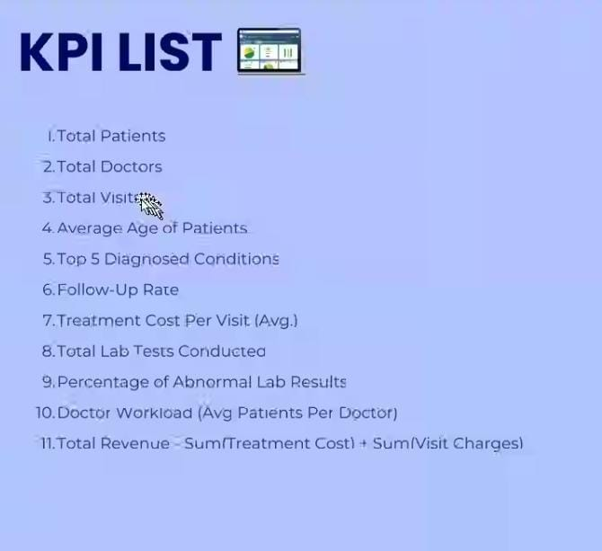

# Healthcare Analytics Project

## Overview

This project is a Healthcare Analytics Dashboard built using Excel, Power BI, Tableau, and MySQL.

It helps analyze hospital data such as patient visits, doctor workload, diagnosis trends, lab results, and revenue.

## Project Objective

The objective of this project is to analyze healthcare data to improve patient care, optimize doctor workload, and identify key trends in diagnosis, treatment, and lab results.

## Tools Used

* Excel
* Power BI
* Tableau
* MySQL

## Key Features

* Interactive dashboards using Power BI, Tableau, and Excel
* KPI tracking for hospital performance
* Analysis of patient demographics and diagnosis trends
* Doctor workload analysis
* Lab test result analysis (Normal vs Abnormal)
* Revenue and treatment cost analysis

## What I Did in the Project

* Designed and developed a Healthcare Analytics Dashboard to analyze hospital data
* Collected and worked with datasets containing patient, doctor, visit, and lab test information
* Performed data cleaning and preprocessing to handle missing values and inconsistencies
* Wrote SQL queries to calculate key performance indicators (KPIs) such as total patients, visits, revenue, and follow-up rate
* Built interactive dashboards using Excel, Power BI, and Tableau for data visualization
* Created visualizations like bar charts, pie charts, and line charts to identify trends and patterns
* Analyzed patient demographics, diagnosis trends, and lab test results to generate insights
* Evaluated doctor workload by calculating average patients per doctor
* Derived business insights to support better healthcare decision-making
  
## Challenges Faced in Project

* Handling raw healthcare data with missing and inconsistent values
* Understanding relationships between multiple tables (patients, doctors, visits, lab tests)
* Writing accurate SQL queries for KPIs like follow-up rate, revenue, and doctor workload
* Designing dashboards that are clear and not overloaded with too many visuals
* Choosing the right visualizations to represent healthcare insights effectively
* Managing large datasets in Excel and Power BI without performance issues
## How I Solved Them

* Cleaned and transformed data using Excel and SQL (handled null values, duplicates)
* Created proper relationships between tables for accurate analysis
* Used aggregate functions and grouping in SQL to calculate KPIs correctly
* Focused on simple and meaningful dashboard design instead of adding too many visuals
* Selected appropriate charts (bar, pie, line) based on data type
* Optimized data handling by reducing unnecessary columns and improving queries

## How to Use

1. Download files from the "files" folder
2. Open Excel / Power BI / Tableau dashboards
3. Explore KPIs and insights
4. Use SQL file to understand backend queries
  

## Key Insights

* Total Patients: 10,000
* Total Doctors: 1,000
* Average Age: 49+
* Follow-up Rate: ~20%
* Average Cost: ₹524+

## Business Insights

* Most patients fall under middle-age and senior categories, indicating higher healthcare demand in older populations.
* Common diagnoses include Asthma, Diabetes, and Hypertension, showing trends in chronic conditions.
* Follow-up rate is around 20%, suggesting scope for improving patient retention and care continuity.
* Lab test results show a balanced distribution of abnormal and normal cases.
* Doctor workload varies significantly, indicating possible need for workload balancing.
 

## Files

All project files are inside the **files folder**.

## Dashboard Screenshots

### Excel Dashboard

### Power BI Dashboard

### Tableau Dashboard

### KPI List

## Author

Akash Gubbe

